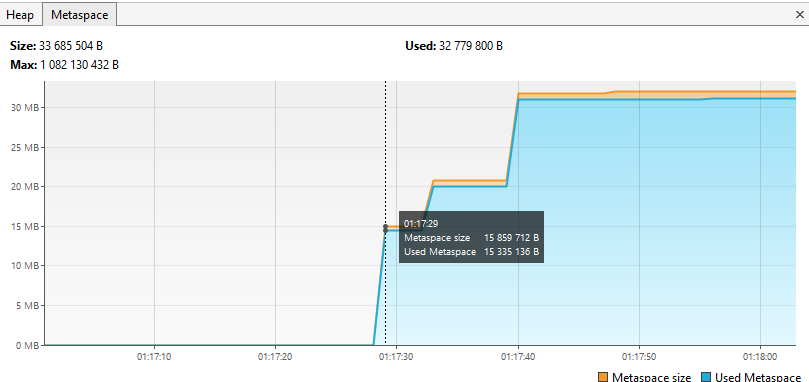
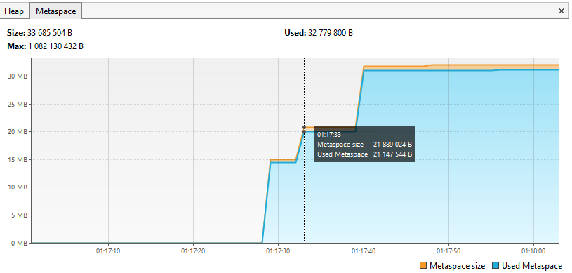

### Результат работы программы:
```

01:17:28.397787600: loading io.vertx // загрузка классов из пакета io.vertx

01:17:29.099595900: loaded 529 classes // графики растут:на Classes и Metaspace, на Heap не значительно.
```

```
01:17:32.115609900: loading io.netty // загрузка классов из пакета io.netty

01:17:33.529734900: loaded 2117 classes // графики растут:на Classes и Metaspace. на Heap график упал сработал сборщик мусора.
```

```
01:17:36.540764200: loading org.springframework // загрузка классов из пакета org.springframework

01:17:36.899707900: loaded 869 // графики растут:на Classes и Heap. в Metaspace не изменилась.
```

```
01:17:39.904122900: now see heap //Сообщении о необходимости смотреть на загрузку в куче

01:17:39.904122900: creating 5000000 objects // создание 5 млн объектов

01:17:40.439630800: created //  Classes только +1, график почти не изменился, 
значение Heap выросло из-за большого количества созданных объектов, Не понял почему вырос график Metaspace( могу предположить что случилась какая то задержка от подгрузки классов из пакета org.springframework.)
```

```
01:17:43.453080: creating 5000000 objects // создание 5 млн объектов

01:17:43.865183600: created // создано 5 млн объектов, 
значение Heap выросло из-за сознания большого количества объектов, увеличился heap size. Classes и  Metaspace без изменений.
```

``` 
01:17:47.580556800: creating 5000000 objects // создание 5 млн объектов

01:17:47.956431200: created // создано 5 млн объектов, значение Heap выросло из-за сознания большого количества объектов. Classes и  Metaspace без изменений.

```

```


